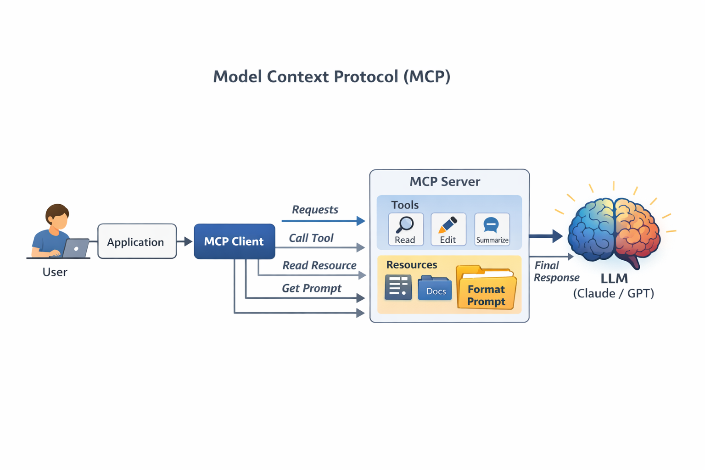

# Introduction to Model Context Protocol (MCP)



---

**Repository summary**

1. **Intro** 🧳

This project demonstrates how to build a functional Model Context Protocol (MCP) system from scratch, starting with the core concepts and progressively adding an MCP server, an MCP client, tools, resources, prompts, and a CLI interface for real-time interaction with Claude. It serves both as an educational journey and a fully reproducible implementation based on the official Anthropic MCP course.

2. **Tech Stack** 🤖

The system is built entirely with modern, lightweight tools: 

```
• Python 3.10+
• MCP Python SDK (mcp[cli] >= 1.8.0) for server and client implementation
• Anthropic SDK (anthropic >= 0.51.0) for Claude integration
• Pydantic for type hints and Field descriptions
• prompt-toolkit for the interactive CLI interface
• python-dotenv for environment variable management
• uv for fast Python package management (optional but recommended)
```

The project is intentionally structured so every component can be inspected and understood.

3. **Features** 🤳🏽

- MCP Server with Tools, Resources, and Prompts fully implemented
- MCP Client with `list_tools()`, `call_tool()`, `list_prompts()`, `get_prompt()`, and `read_resource()`
- In-memory document management system (read and edit documents)
- CLI interface with `@document` mention support and `/command` slash commands
- MCP Server Inspector integration for interactive debugging
- Complete request-response flow from user query to Claude to external tools and back

4. **Process** 👣

The project follows a clean, incremental learning path:

1. Understand MCP architecture and the problem it solves
2. Set up the MCP server with FastMCP
3. Define Tools using Python decorators
4. Implement Resources (static and templated)
5. Create Prompts for predefined workflows
6. Build the MCP Client to communicate with the server
7. Connect everything with Claude through a CLI app

Each stage builds on the previous one, making the full pipeline easy to follow.

5. **Learning** 💡

Throughout the repo, you learn:

- How MCP shifts tool definition burden from your server to specialized MCP servers
- Why MCP is transport-agnostic and what that means in practice
- How the three core primitives (Tools, Resources, Prompts) differ and when to use each
- How Claude communicates with MCP servers through `ListToolsRequest` and `CallToolRequest`
- How to test and debug MCP servers using the built-in Server Inspector
- How to structure real MCP projects for scalability and maintainability

The goal is not just to use MCP, but to deeply understand how it works.

6. **Improvement** 🔩

Future development focuses on:

- Connecting to real external services (GitHub, Notion, Google Drive)
- Implementing HTTP/SSE transport for remote MCP servers
- Adding authentication and security layers
- Expanding to multiple MCP servers connected simultaneously
- Building a web-based UI instead of CLI
- Adding evaluation and logging for tool usage

This repository is designed to evolve into a more capable MCP integration platform.

7. **Running the Project** ⚙️

You can run the project in two ways:

**Option 1: Using uv (Recommended)**

```bash
pip install uv
uv venv
source .venv/bin/activate  # On Windows: .venv\Scripts\activate
uv pip install -e .
uv run main.py
```

**Option 2: Standard Python**

```bash
python -m venv .venv
source .venv/bin/activate  # On Windows: .venv\Scripts\activate
pip install anthropic python-dotenv prompt-toolkit "mcp[cli]==1.8.0"
python main.py
```

**Testing the MCP Server with the Inspector:**

```bash
mcp dev mcp_server.py
# Open browser at http://127.0.0.1:6274
```

8. **More** 🙌🏽

For collaboration, discussion, or improvements:

- GitHub Issues: for bugs or feature requests.
- Pull Requests: for contributions or new examples.
- Contact: open an issue or connect via LinkedIn / email (author info in profile).

If this project helps you learn or build better MCP integrations, consider starring ⭐ the repository — it's the simplest way to support continued open knowledge sharing.

---

# 💻 Introduction to Model Context Protocol (MCP) 💻

---

# 0. Why Learn MCP?

Building with the Model Context Protocol is not about replacing existing integrations — it is about understanding and standardizing how AI models connect to the outside world. When you implement every component by hand, from tool definitions to client sessions to resource URIs, the architecture stops being a black box and becomes an engineered system whose internal logic you can navigate with confidence.

Most developers who use AI APIs write custom integration code for every service they connect to. That approach is functional, but it creates an ever-growing maintenance burden: every tool schema written manually, every API call wrapped individually, every update requiring edits across multiple files.

MCP exists to solve that. It introduces a universal protocol that shifts tool definition and execution from your application to specialized MCP servers — so you connect once and access everything.

This project exists for that purpose. It aims to reconstruct the core pieces of an MCP system with clarity and intention, taking nothing for granted. Every function, every message type, and every architectural decision is exposed. You are able to see how a user query propagates through a CLI app, how the MCP client discovers available tools, how Claude decides which tool to invoke, and how results flow back to produce a final answer.

Once you build an MCP system from scratch, you earn three key advantages. First, you gain the ability to debug and modify any part of the integration without relying on hidden implementations. Second, you develop intuition for why certain design decisions — such as transport agnosticism or the three primitives — matter for flexibility and scalability. And third, you become independent: capable of building, extending, and publishing your own MCP servers rather than depending solely on what others have created.

This repository is the outcome of that philosophy. It walks through the entire lifecycle of an MCP system — from raw concepts to a working CLI chatbot that uses Claude and MCP tools to manage documents — while keeping every component transparent and accessible.

---

# 1. What is MCP and the Problem it Solves

The Model Context Protocol (MCP) is a communication layer that provides Claude with context and tools without requiring you to write large amounts of tedious integration code. Think of it as a way to shift the burden of tool definitions and execution away from your server to specialized MCP servers.

## 1.1 The Traditional Problem

Let's say you are building a chat interface where users can ask Claude about their GitHub data. A user might ask "What open pull requests are there across all my repositories?" To handle this, Claude needs tools to access GitHub's API.

GitHub has massive functionality: repositories, pull requests, issues, projects, and much more. Without MCP, you would need to create a large number of tool schemas and functions to handle all of GitHub's features — all written manually, all maintained by you.

```
Without MCP — you write everything yourself:

get_repositories()       → manual JSON schema
get_pull_requests()      → manual JSON schema
get_issues()             → manual JSON schema
create_branch()          → manual JSON schema
merge_pull_request()     → manual JSON schema
... (x100 more)
```

This means writing, testing, and maintaining all that integration code yourself. That is a lot of effort and ongoing maintenance burden.

## 1.2 How MCP Solves It

MCP shifts this burden by moving tool definitions and execution from your server to dedicated MCP servers. Instead of you authoring all those GitHub tools, an MCP Server for GitHub handles it.

```
With MCP — someone else did the heavy lifting:

Your App → MCP Client → MCP Server (GitHub) → GitHub API
                        [tools already defined]
                        [schemas already written]
                        [maintenance handled]
```

The MCP Server wraps up tons of functionality around a service and exposes it as a standardized set of tools. Your application connects to this MCP server instead of implementing everything from scratch.

## 1.3 The Universal Adapter Analogy

Think of MCP as the USB standard for AI integrations:

| Without MCP | With MCP |
|---|---|
| Custom cable for every device | One universal connector |
| N models × M services = N×M integrations | N models + M services = N+M implementations |
| Every update breaks your code | Update the MCP server, everyone benefits |
| You maintain everything | Service providers maintain their own servers |

## 1.4 Who Authors MCP Servers?

Anyone can create an MCP server implementation. Often, service providers themselves will make their own official MCP implementations. For example, AWS might release an official MCP server with tools for their various services. The community also creates and shares MCP servers for services that don't have official implementations yet.

## 1.5 Basic Architecture

```
┌──────────────────────────────────────────────────────┐
│                    YOUR APPLICATION                  │
│                                                      │
│   ┌──────────┐    ┌──────────────┐    ┌──────────┐  │
│   │   User   │───►│  Our Server  │───►│  Claude  │  │
│   └──────────┘    └──────┬───────┘    └──────────┘  │
│                          │                           │
│                   ┌──────▼───────┐                   │
│                   │  MCP Client  │                   │
│                   └──────┬───────┘                   │
└──────────────────────────┼───────────────────────────┘
                           │
              ┌────────────▼────────────┐
              │       MCP SERVER        │
              │  ┌─────────────────┐    │
              │  │     Tools       │    │
              │  │   Resources     │    │
              │  │    Prompts      │    │
              │  └─────────────────┘    │
              └────────────┬────────────┘
                           │
              ┌────────────▼────────────┐
              │    External Service     │
              │  (GitHub, AWS, etc.)    │
              └─────────────────────────┘
```

---

# 2. Project Setup

This project is a CLI-based chatbot that implements both an MCP client and an MCP server for educational purposes. In real-world projects, you would typically implement only one — either the client (your application) or the server (your service integration).

## 2.1 Project Structure

```
mcp-from-scratch/
│
├── mcp_server.py          # MCP Server with tools, resources, and prompts
├── mcp_client.py          # MCP Client for communicating with the server
├── main.py                # Application entry point and orchestration
├── core/
│   ├── claude.py          # Claude API integration
│   ├── cli_chat.py        # Chat logic connecting all components
│   └── cli.py             # CLI interface with autocomplete
├── ima/                   # Images for documentation
├── .env.example           # Environment variable template
├── pyproject.toml         # Project dependencies
└── README.md              # This file
```

## 2.2 Environment Setup

**Step 1:** Copy the environment template and fill in your credentials.

```bash
cp .env.example .env
```

Edit `.env` and add:

```
ANTHROPIC_API_KEY="your-api-key-here"
CLAUDE_MODEL="claude-sonnet-4-20250514"
```

**Step 2:** Install dependencies using uv (recommended) or pip.

```bash
# With uv
pip install uv
uv venv && source .venv/bin/activate
uv pip install -e .

# With pip
python -m venv .venv && source .venv/bin/activate
pip install anthropic python-dotenv prompt-toolkit "mcp[cli]==1.8.0"
```

**Step 3:** Run the project.

```bash
uv run main.py   # with uv
python main.py   # with pip
```

**Step 4:** Verify everything works by asking a simple question:

```
> what is 2 plus 2?
```

## 2.3 Document System

The project includes a set of in-memory documents used for demonstrating tools and resources:

```python
docs = {
    "deposition.md":  "This deposition covers the testimony of Angela Smith, P.E.",
    "report.pdf":     "The report details the state of a 20m condenser tower.",
    "financials.docx": "These financials outline the project's budget and expenditures.",
    "outlook.pdf":    "This document presents the projected future performance of the system.",
    "plan.md":        "The plan outlines the steps for the project's implementation.",
    "spec.txt":       "These specifications define the technical requirements for the equipment.",
}
```

These documents exist only in memory — no files are created on disk. This keeps the setup simple and focused on the MCP concepts.

---

# 3. MCP Clients

The MCP client serves as the communication bridge between your server and MCP servers. It is your access point to all the tools that an MCP server provides, handling the message exchange and protocol details so your application does not have to.

## 3.1 Transport Agnostic Communication

One of MCP's key strengths is being transport agnostic — the client and server can communicate over different protocols depending on your setup:

| Transport | Use Case |
|---|---|
| **stdio** | Client and server on the same machine (most common) |
| **HTTP** | Remote server in the cloud |
| **WebSockets** | Real-time bidirectional communication |

In this project, we use stdio because both the MCP client and server run on the same machine.

## 3.2 MCP Message Types

Once connected, the client and server exchange specific message types defined in the MCP specification:

```
ListToolsRequest   →  "What tools do you provide?"
ListToolsResult    ←  [list of available tools]

CallToolRequest    →  "Run this tool with these arguments"
CallToolResult     ←  [result of the tool execution]
```

## 3.3 Complete Request-Response Flow

Here is the full flow when a user asks "What repositories do I have?":

```
1.  User          →  Submits question to the CLI
2.  Our Server    →  Needs to know available tools
3.  MCP Client    →  Sends ListToolsRequest to MCP Server
4.  MCP Server    →  Returns ListToolsResult with tool list
5.  Our Server    →  Sends question + tools to Claude
6.  Claude        →  Decides to call get_repos() tool
7.  Our Server    →  Asks MCP Client to run that tool
8.  MCP Client    →  Sends CallToolRequest to MCP Server
9.  MCP Server    →  Makes the actual API call
10. MCP Server    →  Returns CallToolResult with data
11. Claude        →  Formulates final answer using the data
12. User          →  Receives the complete response ✅
```

## 3.4 Client Implementation

The MCP client is implemented as a wrapper class around the `ClientSession` from the MCP Python SDK:

```python
class MCPClient:
    async def list_tools(self) -> list[types.Tool]:
        result = await self.session().list_tools()
        return result.tools

    async def call_tool(self, tool_name: str, tool_input: dict):
        return await self.session().call_tool(tool_name, tool_input)

    async def list_prompts(self) -> list[types.Prompt]:
        result = await self.session().list_prompts()
        return result.prompts

    async def get_prompt(self, prompt_name, args: dict[str, str]):
        result = await self.session().get_prompt(prompt_name, args)
        return result.messages

    async def read_resource(self, uri: str) -> Any:
        result = await self.session().read_resource(AnyUrl(uri))
        resource = result.contents[0]
        if isinstance(resource, types.TextResourceContents):
            if resource.mimeType == "application/json":
                return json.loads(resource.text)
        return resource.text
```

The class also handles resource cleanup automatically through `__aenter__` and `__aexit__`, ensuring connections are properly closed when the application shuts down.

---

# 4. Defining Tools with MCP

Tools are the first and most important MCP primitive. They are functions that Claude can invoke autonomously to perform actions. Claude decides when and how to use them based on the user's query.

## 4.1 The SDK Advantage

Without the MCP Python SDK, you would need to write complex JSON schemas manually for every tool:

```json
// Without SDK — tedious and error-prone
{
  "name": "read_doc_contents",
  "description": "Read the contents of a document",
  "input_schema": {
    "type": "object",
    "properties": {
      "doc_id": {
        "type": "string",
        "description": "Id of the document to read"
      }
    },
    "required": ["doc_id"]
  }
}
```

With the SDK, you use Python decorators and type hints. The SDK generates the JSON schema automatically:

```python
# With SDK — clean and simple
@mcp.tool(
    name="read_doc_contents",
    description="Read the contents of a document and return it as a string."
)
def read_document(
    doc_id: str = Field(description="Id of the document to read")
):
    if doc_id not in docs:
        raise ValueError(f"Doc with id {doc_id} not found")
    return docs[doc_id]
```

## 4.2 The Three Parts of Every Tool

Every tool definition has four essential components:

| Component | Purpose |
|---|---|
| `name` | How Claude identifies the tool |
| `description` | How Claude decides **when** to use it |
| `Field(description=...)` | How Claude knows **what data** to pass |
| Function logic | What the server **actually does** |

The description is critical. If it is vague or inaccurate, Claude will not know when to use the tool.

## 4.3 Tools Implemented in This Project

**Tool 1 — Read a document:**

```python
@mcp.tool(
    name="read_doc_contents",
    description="Read the contents of a document and return it as a string."
)
def read_document(
    doc_id: str = Field(description="Id of the document to read")
):
    if doc_id not in docs:
        raise ValueError(f"Doc with id {doc_id} not found")
    return docs[doc_id]
```

**Tool 2 — Edit a document:**

```python
@mcp.tool(
    name="edit_document",
    description="Edit a document by replacing a string in the document's content with a new string."
)
def edit_document(
    doc_id: str = Field(description="Id of the document to edit"),
    old_str: str = Field(description="The text to replace. Must match exactly, including whitespace."),
    new_str: str = Field(description="The new text to insert in place of the old text.")
):
    if doc_id not in docs:
        raise ValueError(f"Doc with id {doc_id} not found")
    docs[doc_id] = docs[doc_id].replace(old_str, new_str)
```

## 4.4 How Claude Chooses a Tool

Claude reads the `description` of each tool and decides which one fits the user's request:

```
User asks: "What does the report.pdf say?"

Claude reads available tools:
  ✅ "read_doc_contents" → "Read the contents of a document" ← this one
  ❌ "edit_document"     → "Edit a document by replacing..."  ← not needed

Claude invokes: read_doc_contents("report.pdf")
MCP Server executes and returns the content
Claude responds with the document's content
```

---

# 5. The Server Inspector

When building MCP servers, you need a way to test your functionality without connecting to a full application. The MCP Python SDK includes a built-in browser-based inspector that lets you debug and test your server in real-time.

## 5.1 Starting the Inspector

With your virtual environment activated, run:

```bash
mcp dev mcp_server.py
```

This starts a development server and provides a local URL, typically `http://127.0.0.1:6274`. Open this URL in your browser to access the MCP Inspector.

## 5.2 Using the Inspector Interface

The inspector provides a clean interface with tabs for each primitive type:

```
Left sidebar  → Connect button (initializes your server)
Top navigation → Resources | Prompts | Tools tabs
Right panel   → Tool input fields and results
```

**Testing a tool step by step:**

```
1. Click "Connect" → status changes to Connected
2. Navigate to "Tools" tab
3. Click "List Tools" → see all registered tools
4. Select "read_doc_contents"
5. Enter doc_id: "report.pdf"
6. Click "Run Tool"
7. Verify output: "The report details the state of a 20m condenser tower." ✅
```

## 5.3 Development Workflow

The MCP Inspector becomes an essential part of your workflow:

| Without Inspector | With Inspector |
|---|---|
| Build entire app to test | `mcp dev mcp_server.py` |
| Connect all components | Open browser |
| Make a request and wait | Click "Run Tool" |
| Dig through logs to debug | See result immediately |

Think of it as the Postman for MCP — test each tool, resource, and prompt in isolation before wiring everything together.

---

# 6. Defining Resources

Resources in MCP servers expose data to clients for read operations. They are similar to GET endpoints in a REST API — perfect for scenarios where you need to fetch information rather than perform an action.

## 6.1 Resources vs Tools

The key distinction is who controls the interaction:

```
Tools      → Claude decides when to call them
Resources  → Your application decides when to fetch them
```

Resources are ideal for:
- Populating autocomplete options in the UI
- Injecting document content into prompts before calling Claude
- Fetching configuration or metadata

## 6.2 Two Types of Resources

**Direct Resources** have static URIs that never change:

```python
@mcp.resource("docs://documents", mime_type="application/json")
def list_docs() -> list[str]:
    return list(docs.keys())

# URI is always: docs://documents
# Returns: ["deposition.md", "report.pdf", "plan.md", ...]
```

**Templated Resources** include parameters in their URIs:

```python
@mcp.resource("docs://documents/{doc_id}", mime_type="text/plain")
def fetch_doc(doc_id: str) -> str:
    if doc_id not in docs:
        raise ValueError(f"Doc with id {doc_id} not found")
    return docs[doc_id]

# URI changes based on the document:
# docs://documents/report.pdf
# docs://documents/plan.md
```

The MCP Python SDK automatically parses URI parameters and passes them as function arguments.

## 6.3 MIME Types

Use the `mime_type` parameter to tell clients how to interpret the returned data:

| MIME Type | When to use |
|---|---|
| `application/json` | Structured data (lists, objects) |
| `text/plain` | Plain text documents |
| `application/pdf` | Binary PDF files |

When the client receives a resource, it checks the MIME type to decide how to parse it.

## 6.4 Resource Flow

```
Your app code                MCP Client              MCP Server
    │                             │                       │
    │── read_resource(uri) ──────►│                       │
    │                             │── ReadResourceRequest►│
    │                             │                       │── matches URI
    │                             │                       │── runs function
    │                             │◄── ReadResourceResult ─│
    │◄── parsed content ──────────│                       │
    │                             │                       │
```

---

# 7. Accessing Resources

Resources in MCP allow your server to expose information that can be directly included in prompts, rather than requiring Claude to use tool calls to access data. This creates a more efficient way to provide context.

## 7.1 The `read_resource` Function

The MCP client reads resources through a single function:

```python
async def read_resource(self, uri: str) -> Any:
    result = await self.session().read_resource(AnyUrl(uri))
    resource = result.contents[0]

    if isinstance(resource, types.TextResourceContents):
        if resource.mimeType == "application/json":
            return json.loads(resource.text)   # parse as structured data

    return resource.text                        # return as plain text
```

## 7.2 Resource Integration in the CLI

When a user types `@report.pdf` in the CLI, the system automatically:

```
1. Detects the "@" symbol
2. Calls read_resource("docs://documents/report.pdf")
3. Gets the document content
4. Injects it directly into the prompt sent to Claude
5. Claude responds without needing to call any tools

Result: faster, more efficient responses ✅
```

## 7.3 Resources vs Tools for Data Access

```
Without Resources:
  User asks → Claude uses read_doc_contents tool → gets content → responds
  (Claude makes an extra round trip)

With Resources:
  User types @doc → App injects content before calling Claude → Claude responds
  (Content arrives with the initial request, no extra round trip)
```

---

# 8. Defining Prompts

Prompts in MCP servers let you define pre-built, high-quality instructions that clients can use instead of writing their own prompts from scratch. Think of them as carefully crafted templates that produce better, more consistent results than what users might write on their own.

## 8.1 Why Prompts Matter

Users can already ask Claude to perform most tasks directly. But they will get significantly better results if you provide a thoroughly tested, specialized prompt that handles edge cases and follows best practices.

As the MCP server author, you invest time crafting, testing, and refining prompts that work consistently. Users benefit from your expertise without having to become prompt engineering experts themselves.

```
User writes their own prompt:
  "reformat the report.pdf in markdown"
  → decent results, inconsistent quality 😐

User invokes the /format prompt:
  → carefully crafted instructions
  → consistent, professional output every time ✅
```

## 8.2 Prompt Implementation

Prompts use the same decorator pattern as tools and resources:

```python
@mcp.prompt(
    name="format",
    description="Rewrites the contents of the document in Markdown format."
)
def format_document(
    doc_id: str = Field(description="Id of the document to format")
) -> list[base.Message]:
    prompt = f"""
    Your goal is to reformat a document to be written with markdown syntax.

    The id of the document you need to reformat is:
    <document_id>
    {doc_id}
    </document_id>

    Add in headers, bullet points, tables, etc as necessary.
    Use the 'edit_document' tool to save the changes.
    After editing, respond with the final version. Don't explain your changes.
    """
    return [base.UserMessage(prompt)]
```

The function returns a list of messages that get sent directly to Claude. The `doc_id` argument is interpolated into the prompt template at runtime.

## 8.3 The `/format` Workflow

```
User types: /format
      ↓
CLI shows available prompts: [format, summarize, ...]
      ↓
User selects "format" and chooses "plan.md"
      ↓
App calls get_prompt("format", {"doc_id": "plan.md"})
      ↓
MCP Server builds the full prompt with "plan.md" inserted
      ↓
App sends the formatted prompt to Claude
      ↓
Claude reads the doc using read_doc_contents
      ↓
Claude rewrites it in Markdown and saves with edit_document
      ↓
User receives the formatted document ✅
```

## 8.4 Key Benefits of Prompts

| Benefit | Description |
|---|---|
| Consistency | Users get reliable results every time |
| Expertise | Encode domain knowledge into the prompt |
| Reusability | Multiple apps can share the same prompts |
| Maintenance | Update in one place to improve all clients |

---

# 9. Prompts in the Client

The final step in building the MCP client is implementing prompt functionality. This allows the application to discover available prompts and retrieve them with variables filled in.

## 9.1 List Prompts

```python
async def list_prompts(self) -> list[types.Prompt]:
    result = await self.session().list_prompts()
    return result.prompts
```

This is used to populate the slash command autocomplete in the CLI — when a user types `/`, all available prompts appear as suggestions.

## 9.2 Get Prompt

```python
async def get_prompt(self, prompt_name, args: dict[str, str]):
    result = await self.session().get_prompt(prompt_name, args)
    return result.messages
```

Arguments provided by the client become keyword arguments in the prompt function on the server side. The server interpolates them into the template and returns the fully formed messages ready for Claude.

## 9.3 Arguments Flow

```
Client calls: get_prompt("format", {"doc_id": "plan.md"})
                                          │
                               Server receives: doc_id = "plan.md"
                                          │
                               Server inserts into template:
                               "The id of the document is: plan.md"
                                          │
                               Returns: [UserMessage(full_prompt)]
                                          │
                               App sends to Claude
```

---

# 10. MCP Review: The Three Primitives

This section summarizes the most important architectural insight of the entire project: every MCP primitive is controlled by a different part of your application stack.

## 10.1 Tools — Model-Controlled

Tools are controlled entirely by Claude. The AI model decides when to call these functions, and the results are used directly by Claude to accomplish tasks.

```python
@mcp.tool(name="read_doc_contents", description="...")
def read_document(doc_id: str = Field(...)):
    return docs[doc_id]
```

**Use tools when:** You need to give Claude new capabilities it can use autonomously.

**Real example from Claude.ai:** When Claude executes JavaScript code to perform a calculation, it is using a tool behind the scenes.

## 10.2 Resources — App-Controlled

Resources are controlled by your application code. Your app decides when to fetch resource data and how to use it — typically for UI elements or to add context to conversations.

```python
@mcp.resource("docs://documents", mime_type="application/json")
def list_docs() -> list[str]:
    return list(docs.keys())
```

**Use resources when:** You need to get data into your app for display or context injection.

**Real example from Claude.ai:** The "Add from Google Drive" feature — the application determines which documents to show and handles injecting their content into the conversation.

## 10.3 Prompts — User-Controlled

Prompts are triggered by user actions. Users decide when to run these predefined workflows through UI interactions like button clicks, menu selections, or slash commands.

```python
@mcp.prompt(name="format", description="...")
def format_document(doc_id: str = Field(...)) -> list[base.Message]:
    return [base.UserMessage(prompt_text)]
```

**Use prompts when:** You want to create predefined workflows that users can trigger on demand.

**Real example from Claude.ai:** The workflow buttons below the chat input — predefined, optimized workflows that users can start with a single click.

## 10.4 Decision Guide

```
Need to give Claude a new capability?    → Tools    🔧
Need data for your UI or prompt context? → Resources 📦
Want a workflow the user can trigger?    → Prompts  💬
```

## 10.5 Who Each Primitive Serves

```
Tools      →  serve the MODEL  (Claude decides)
Resources  →  serve the APP    (code decides)
Prompts    →  serve the USER   (human decides)
```

Three primitives, three owners, one universal protocol. That is MCP.

---

# 11. Examples

This section showcases the working application built in this project. The examples illustrate how the CLI interface connects to the MCP server, uses Claude to process queries, and applies tools, resources, and prompts to manage documents.

## 11.1 Basic Document Query (Tool Usage)

```
> What does the report.pdf say?

[Claude invokes read_doc_contents("report.pdf")]
→ "The report details the state of a 20m condenser tower."
```

## 11.2 Document Mention via @ Symbol (Resource Usage)

```
> @deposition.md Can you summarize this document for me?

[App reads resource: docs://documents/deposition.md]
[Content injected into prompt before calling Claude]
→ "The deposition covers the testimony of Angela Smith, P.E."
```

## 11.3 Slash Command (Prompt Usage)

```
> /format
  Select document: [plan.md]

[App retrieves format prompt with doc_id="plan.md"]
[Claude reads document and rewrites it in Markdown]
→ Returns the document formatted with headers, bullet points, and tables
```

## 11.4 MCP Server Inspector

```bash
mcp dev mcp_server.py
# Navigate to http://127.0.0.1:6274
# Connect → Tools → List Tools → Select tool → Run Tool → See result
```

---

# 12. Improvements

Building with MCP from scratch reveals both its strengths and its current limitations. This section outlines the most impactful improvements planned for future iterations.

## 12.1 Connect to Real External Services

The current implementation uses in-memory documents. Future versions will connect to real services:

- **GitHub MCP Server** — query repositories, issues, and pull requests
- **Notion MCP Server** — read and write pages and databases
- **Google Drive MCP Server** — access and edit documents
- **Slack MCP Server** — read and post messages

This transforms the project from a demonstration into a production-ready integration platform.

## 12.2 HTTP and SSE Transport

The current setup uses stdio because both the client and server run on the same machine. A remote MCP server would use HTTP with Server-Sent Events:

```python
# Future remote server setup
client = MCPClient(
    transport="http",
    url="https://api.your-mcp-server.com/mcp"
)
```

This enables deploying MCP servers as cloud services accessible from any application.

## 12.3 Multiple MCP Servers Simultaneously

The current project connects to one MCP server. Future versions will support multiple servers connected at the same time, each providing different capabilities:

```
Your App
  ├── MCP Client → GitHub MCP Server   (repositories, PRs)
  ├── MCP Client → Notion MCP Server   (pages, databases)
  └── MCP Client → Slack MCP Server    (channels, messages)
```

Claude would see all tools from all servers and decide which to use.

## 12.4 Web UI Instead of CLI

Replace the command-line interface with a web-based frontend using FastAPI and a React or Streamlit UI, enabling:

- Chat-style conversation history
- Visual document selection
- Real-time tool execution feedback
- Multi-user support

## 12.5 Persistent Document Storage

Replace the in-memory dictionary with a real database:

- SQLite for local development
- PostgreSQL for production
- Vector database for semantic search across documents

## 12.6 Vision for Future Versions

The aim of these improvements is to transform this project from an educational proof of concept into a reference implementation for production-grade MCP systems. The architecture remains the same — the depth, scale, and real-world connectivity simply increase with each iteration.

---

*Built as part of the Anthropic Introduction to Model Context Protocol course.*
*Every component is transparent, hand-structured, and designed to teach the fundamentals of MCP from the ground up.*
